# X-Restormer [[Paper Link]](https://arxiv.org/abs/2205.04437) [](https://replicate.com/cjwbw/hat)

### A Comparative Study of Image Restoration Networks for General Backbone Network Design
[Xiangyu Chen*](https://chxy95.github.io/), [Zheyuan Li*](https://xinntao.github.io/), [Yuandong Pu*](https://andrew0613.github.io/), [Jiantao Zhou](https://www.fst.um.edu.mo/personal/jtzhou/), [Yu Qiao](https://mmlab.siat.ac.cn/yuqiao) and [Chao Dong](https://scholar.google.com.hk/citations?user=OSDCB0UAAAAJ&hl=zh-CN)

#### BibTeX

    @InProceedings{chen2023hat,
        author    = {Chen, Xiangyu and Wang, Xintao and Zhou, Jiantao and Qiao, Yu and Dong, Chao},
        title     = {A Comparative Study of Image Restoration Networks for General Backbone Network Design},
        booktitle = {Proceedings of the IEEE/CVF Conference on Computer Vision and Pattern Recognition (CVPR)},
        month     = {June},
        year      = {2023},
        pages     = {22367-22377}
    }
**Google Scholar has unknown bugs for indexing this paper recently, while it can still be cited by the above BibTeX.**

## Updates
- **(To do)** 2022-05-09: Release the first version of the paper at Arxiv.
- **(To do)** 2022-05-20: Release the codes, models and results of HAT.
- **(To do)** Release the extended version of the paper.
- **(To do)** Add the tile mode for Replicate demo.
- **(To do)** Update the Replicate demo for Real-World SR.
- **(To do)** Add HAT models for Multiple Image Restoration tasks.

## Overview
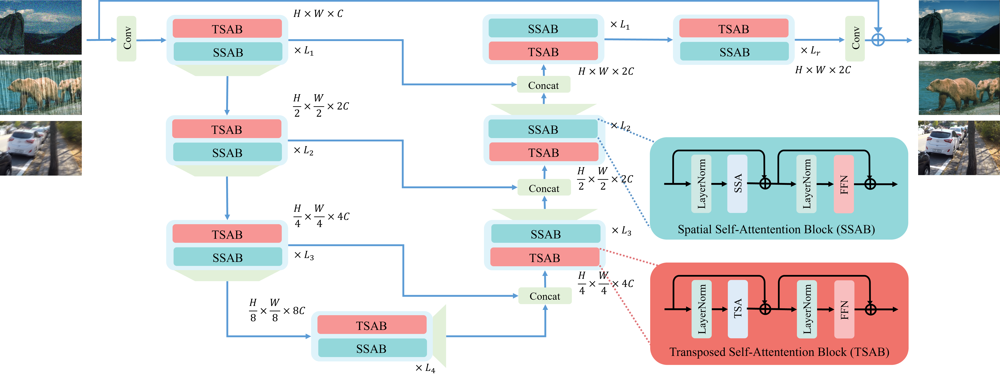

<div style="display: flex; justify-content: center;">
    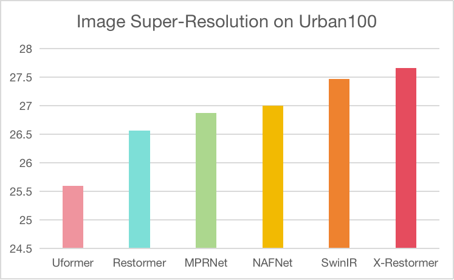
    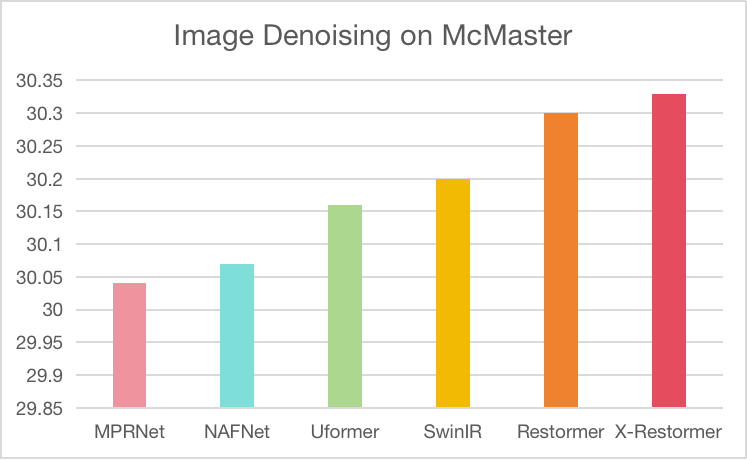
</div>
<div style="display: flex; justify-content: center;">
    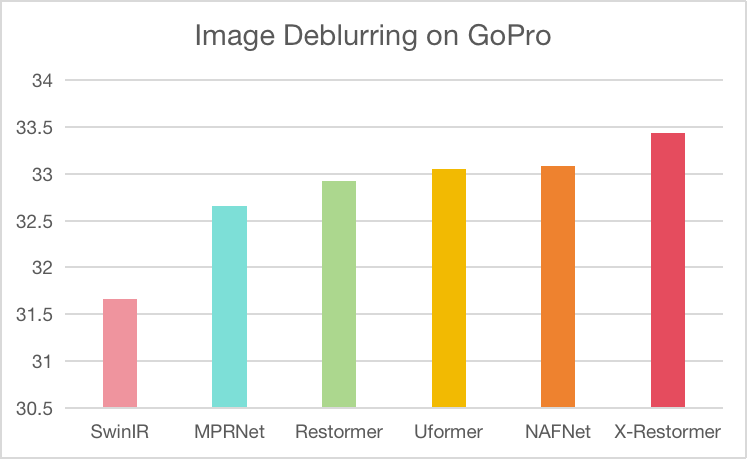
    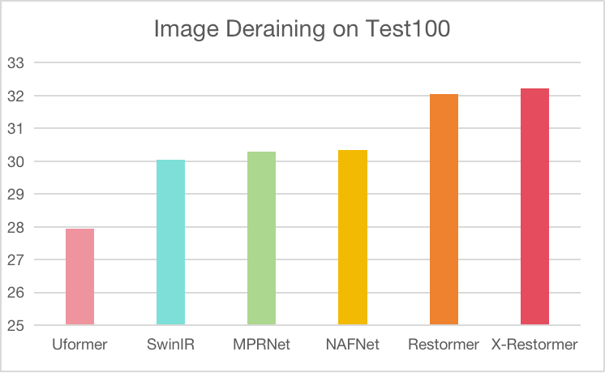
</div>
<div style="display: flex; justify-content: center;">
    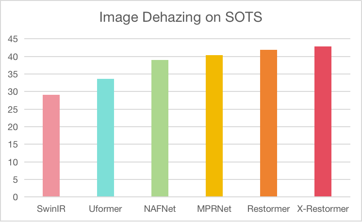
</div>
<!--  -->

**Benchmark results on SRx4 without x2 pretraining. FLOPs are calculated for a 64x64 input.**

|    Method   | Params(M) | FLOPs(G) |     Set5     |     Set14    |    BSD100    |   Urban100   |   Manga109   |
|:-----------:|:---------:|:--------:|:------------:|:------------:|:------------:|:------------:|:------------:|
|    SwinIR   |    11.9   |   47.3   | 32.88/0.9041 | 29.07/0.7944 | 27.93/0.7490 | 27.47/0.8258 | 31.96/0.9255 |
|  Restormer  |    26.1   |   141.0  | 32.50/0.8991 | 28.85/0.7870 | 27.74/0.7420 | 26.57/0.7994 | 31.11/0.9158 |
| X-Restormer |    26.0   |   164.3  | 33.16/0.9058 | 29.17/0.7963 | 28.00/0.7512 | 27.66/0.8291 | 32.38/0.9279 |

**Benchmark results on Deblurring. FLOPs are calculated for a 64x64 input.**

|    Method   | Params(M) | FLOPs(G) |     GoPro    |     HIDE     |  RealBlur-R  |  RealBlur-J  |
|:-----------:|:---------:|:--------:|:------------:|:------------:|:------------:|:------------:|
|    SwinIR   |    11.9   |   752.1  | 31.66/0.9209 | 29.41/0.8957 | 35.49/0.9469 | 27.55/0.8403 |
|  Restormer  |    26.1   |   141.0  | 32.92/0.9398 | 31.22/0.9226 | 36.19/0.9571 | 28.96/0.8785 |
| X-Restormer |    26.0   |   164.3  | 33.44/0.9459 | 31.76/0.9299 | 36.27/0.9581 | 28.87/0.8780 |

## Visual Comparison
**Visual Comparison on SR.**

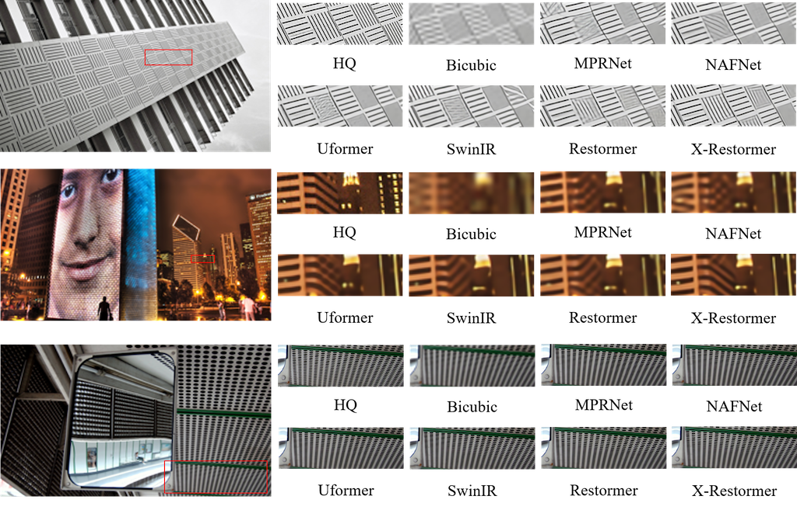

**Visual Comparison on Denoising.**

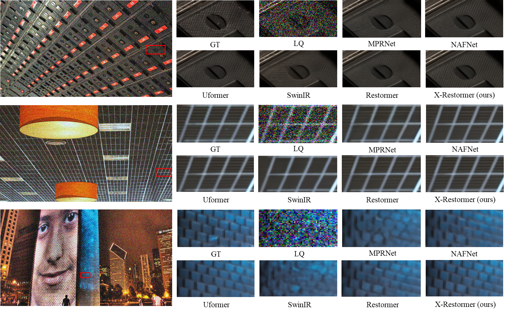

**Visual Comparison on Deblurring.**

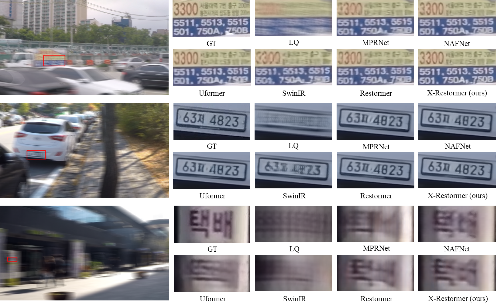

**Visual Comparison on Deraining.**

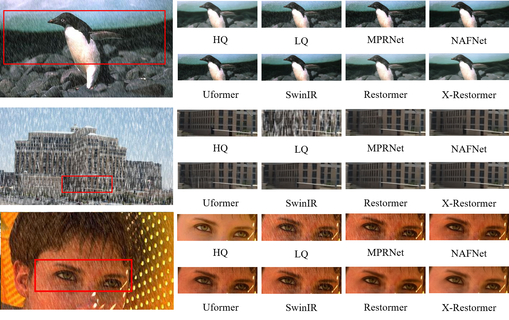

**Visual Comparison on Dehazing.**

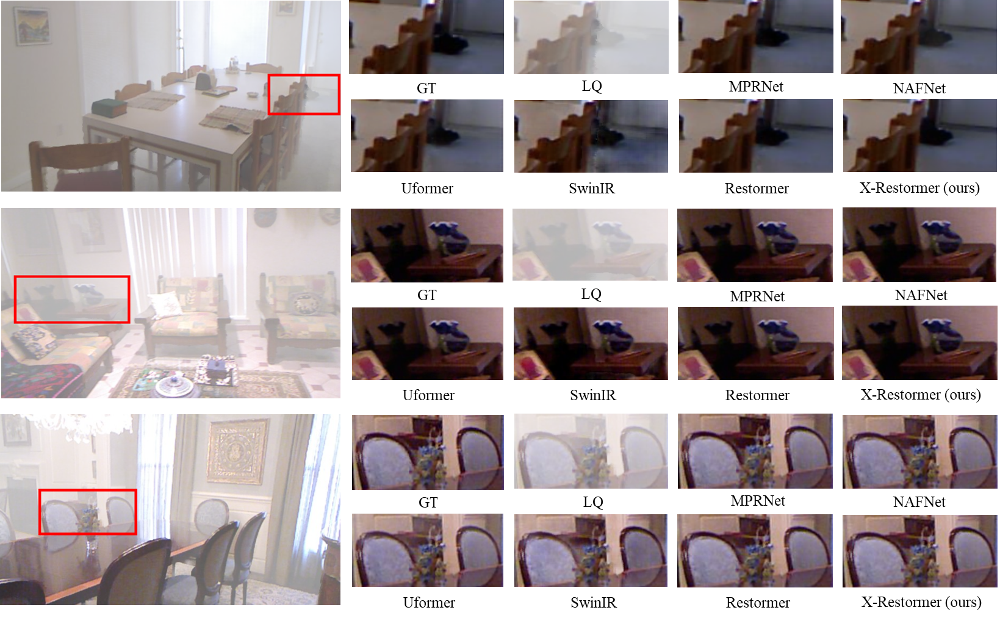

## Environment
- [PyTorch == 1.13.0](https://pytorch.org/) **(Recommend **NOT** using torch 1.8!!! It would cause abnormal performance.)**
- [BasicSR == 1.3.4.9](https://github.com/XPixelGroup/BasicSR/blob/master/INSTALL.md)
### Installation
Install Pytorch first.
Then,
```
pip install -r requirements.txt
python setup.py develop
```

## How To Test

Without implementing the codes, [chaiNNer](https://github.com/chaiNNer-org/chaiNNer) is a nice tool to run our models.

Otherwise,
- Refer to `./options/test` for the configuration file of the model to be tested, and prepare the testing data and pretrained model.
- The pretrained models are available at
[Google Drive](https://drive.google.com/drive/folders/1HpmReFfoUqUbnAOQ7rvOeNU3uf_m69w0?usp=sharing) or [Baidu Netdisk](https://pan.baidu.com/s/1u2r4Lc2_EEeQqra2-w85Xg) (access code: qyrl).
- Then run the follwing codes (taking `HAT_SRx4_ImageNet-pretrain.pth` as an example):
```
python hat/test.py -opt options/test/001_xrestormer_sr.yml
```
The testing results will be saved in the `./results` folder.

- Refer to `./options/test/001_xrestormer_sr.yml` for **inference** without the ground truth image.

**Note that the tile mode is also provided for limited GPU memory when testing. You can modify the specific settings of the tile mode in your custom testing option by referring to `./options/test/HAT_tile_example.yml`.**

## How To Train
- Refer to `./options/train` for the configuration file of the model to train.
- Preparation of training data can refer to [this page](https://github.com/XPixelGroup/BasicSR/blob/master/docs/DatasetPreparation.md). ImageNet dataset can be downloaded at the [official website](https://image-net.org/challenges/LSVRC/2012/2012-downloads.php).
- The training command is like
```
CUDA_VISIBLE_DEVICES=0,1,2,3,4,5,6,7 python -m torch.distributed.launch --nproc_per_node=8 --master_port=1231 xrestormer/train.py -opt ./options/train/001_xrestormer_sr.yml --launcher pytorch
```
- Note that the default batch size per gpu is 4, which will cost about 60G memory for each GPU.

The training logs and weights will be saved in the `./experiments` folder.

## Results
The inference results on benchmark datasets are available at
[Google Drive](https://drive.google.com/drive/folders/1t2RdesqRVN7L6vCptneNRcpwZAo-Ub3L?usp=sharing) or [Baidu Netdisk](https://pan.baidu.com/s/1CQtLpty-KyZuqcSznHT_Zw) (access code: 63p5).


## Contact
If you have any question, please email chxy95@gmail.com or join in the [Wechat group of BasicSR](https://github.com/XPixelGroup/BasicSR#-contact) to discuss with the authors.